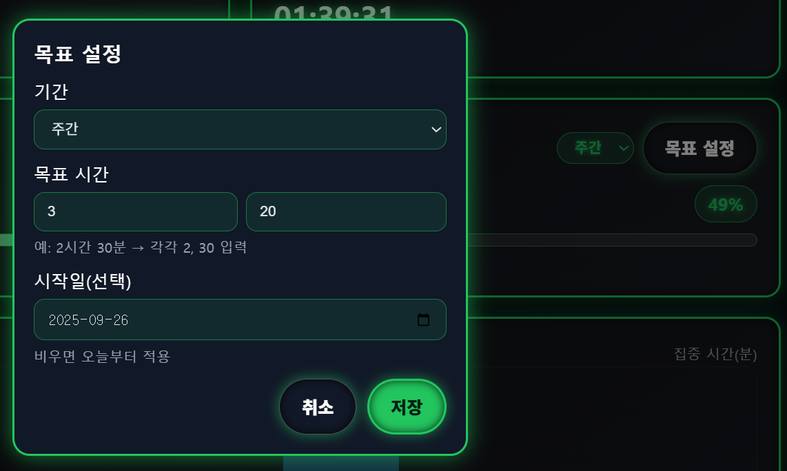

# Focus Bank  
> 디지털 집중력 은행 — 집중을 저축하고, 성장을 인출하세요

---

## 🎥 시연 영상
아래 이미지를 클릭하시면, 유튜브 링크로 연결됩니다.

<a href="https://youtu.be/1hJeWfLENPI" target="_blank">
  
</a>

<br/>

### 프로젝트 개요
**Focus Bank**는 내가 하루에 해야 할 일에 <br/> 
**얼마나 시간을 투자했는지 기록하고 관리하는 웹 애플리케이션**입니다.  
타이머를 실행하여 집중 세션을 시작·종료하면 해당 시간이 자동으로 누적되며,  
👉 집중 시간을 화폐처럼 ‘저축’ 하는 개념으로 관리할 수 있습니다.  

물론 실제로 얼마나 몰입했는지는 시스템이 판단할 수 없으므로,  
**사용자의 양심적인 기록**에 기반합니다.  
그러나 이를 데이터화하여 시각적으로 보여줌으로써,  
습관을 형성하고 자기 성찰의 도구로 활용할 수 있습니다.  

집계된 데이터는 **일·주·월 단위**로 확인할 수 있고,  
랭킹 시스템과 목표 관리 기능을 통해 자기 주도적인 성장을 도와줍니다.  

<br/>

### 🎯 프로젝트 목표
- 하루 동안 **해야 할 일에 얼마나 시간을 썼는지** 확인  
- 집중 시간을 **데이터화**하여 습관 관리 및 피드백 제공  
- **랭킹 시스템**으로 비교와 동기부여 강화  
- **목표 달성 관리**를 통해 성취감과 꾸준한 습관 형성

<br/>

### 🎨 디자인
- **ATM/게임기 UI 콘셉트**  
  - 카드·버튼에 네온 라인, 디지털 시계 느낌 적용  
- **픽셀 폰트 + 산세리프 조합**  
  - 제목은 게임풍 픽셀 폰트, 본문은 가독성 중심 산세리프

---

## 🧱 기술 스택
- **Backend**: Java 17, Spring Boot 3.5.5, MyBatis 3.0.3
- **DB**: MariaDB (HeidiSQL)
- **Frontend**: HTML5, CSS3, Vanilla JS (Chart.js로 시각화, QRCode.js로 세션 연동 QR 생성)
- **Build**: Gradle
- **기타**: Lombok, HikariCP, IntelliJ

---
## ✨ 메인

<br/>
<br/>

## ✨ 주요 기능
- **세션 기록**
  - 입금(시작) / 정산(종료)로 집중 시간 기록
  - 진행 중 세션 실시간 타이머 표시
<table>
  <tr>
    <td></td>
    <td></td>
    <td></td>
  </tr>
</table>
<br/>

- **리포트**
  - 오늘 합계, 주/월 합계
  - 각 회차(오늘) 막대 차트
<table>
  <tr>
    <td></td>
    <td></td>
  </tr>
</table>
<br/>    

- **목표 관리**
  - 일간/주간/월간 목표 설정(업서트)
  - 목표 진행률 조회
<table>
  <tr>
    <td></td>
    <td></td>
  </tr>
</table>
<br/> 
    
- **랭킹**
  - 주간 / 전체 누적 TOP N
<table>
  <tr>
    <td></td>
  </tr>
</table>
<br/> 
 
    
- **프로필(익명)**
  - `X-ANON-ID` 기반, 닉네임 + 태그 지원 (초기 닉네임 미설정시 ANON-ID로 표시됨)
<table>
  <tr>
    <td></td>
    <td></td>
  </tr>
</table>
<br/> 
    
- **QR 코드로 세션 연동**
- 현재 기기의 익명 ID가 포함된 URL을 QR로 생성 → 다른 기기에서 **동일 세션** 이어서 사용
<table>
  <tr>
    <td></td>
    <td></td>
  </tr>
</table>
<br/> 

---

## 📁 폴더 구조 (요약)
```
focus-bank/
  ├─ build.gradle
  ├─ src/
  │  ├─ main/
  │  │  ├─ java/com/pyj/focusbank/
  │  │  │  ├─ controller/        # REST 컨트롤러
  │  │  │  ├─ service/           # 서비스 계층
  │  │  │  ├─ dao/               # MyBatis Mapper 인터페이스
  │  │  │  └─ dto/               # 요청/응답 DTO
  │  │  └─ resources/
  │  │     ├─ mapper/*.xml       # MyBatis 매퍼 XML
  │  │     ├─ static/index.html
  │  │     ├─ application.yml / application-dev.yml
  │  │     └─ static/sql/focus.sql  # 스키마 & 인덱스
  │  └─ test/java/...
  └─ README.md (repo 루트)
```

---

## 🔐 클라이언트 식별 (X-ANON-ID)

- 최초 접속 시 프론트에서 **ULID** 생성 후 `localStorage`에 저장
- 모든 API 호출 시 `X-ANON-ID` 헤더로 전송
- 서버는 이 값을 기준으로 `anonymous_user`를 식별/관리

---

## 🔗 API 빠른 안내

> 전체 상세는 [`docs/API_SPEC`](./docs/API_SPEC.md) 참고

- `POST /api/sessions/deposit` — 세션 시작(입금)  
- `POST /api/sessions/settle?sessionId=...` — 세션 종료(정산)  
- `GET  /api/sessions/active` — 진행 중 세션 조회 (없으면 204)  
- `GET  /api/sessions?date=YYYY-MM-DD` — 해당 날짜의 세션 목록  
- `GET  /api/reports/summary?date=YYYY-MM-DD` — 일일 합계  
- `GET  /api/reports/weekly?weeks=N` — 주간 집계(N주)  
- `GET  /api/reports/monthly?months=N` — 월간 집계(N개월)  
- `POST /api/goals` — 목표 저장(업서트)  
- `GET  /api/goals/current?period=DAILY|WEEKLY|MONTHLY` — 활성 목표 조회  
- `GET  /api/goals/progress?period=daily|weekly|monthly` — 목표 진행률  
- `GET  /api/rankings/weekly?limit=N` — 주간 랭킹  
- `GET  /api/rankings/overall?limit=N` — 전체 누적 랭킹  
- `GET  /api/profile` — 프로필 조회  
- `POST /api/profile/nickname` — 닉네임 저장

---

## 🧩 아키텍처 개요

- **Controller → Service → DAO(MyBatis) → DB** 레이어드 구조
- 트랜잭션은 **Service** 레이어에서 관리
- 집계 테이블(`daily_aggregate`)을 사용해 조회 성능 최적화

자세한 구조/흐름도는 [`docs/SYSTEM_ARCHITECTURE.md`](./docs/SYSTEM_ARCHITECTURE.md) 참고.

---

## 🗄️ DB 개요

핵심 테이블:

- `anonymous_user(anon_id, nickname, nickname_tag, created_at, updated_at)`
- `focus_session(session_id, anon_id, started_at, ended_at, duration_sec, created_at)`
- `daily_aggregate(anon_id, target_date, total_sec, created_at)`
- `user_goal(goal_id, anon_id, period_type, target_seconds, effective_from, created_at)`

상세 스키마/인덱스는 [`docs/DATABASE_SCHEMA.md`](./docs/DATABASE_SCHEMA.md) 참고.

---

## 🛣️ 향후 개선 아이디어
- **연속 달성일 표시**  
  → 캘린더나 🔥 아이콘으로 연속 기록 강조

- **레벨/뱃지 시스템**  
  → 10시간 달성, 100세션 달성 등 업적 뱃지

- **팀/그룹 랭킹**  
  → 친구 초대 → 소규모 그룹끼리 집중시간 랭킹 경쟁

- **CSV/PDF 내보내기**  
  → "내 집중 기록을 PDF 리포트로 뽑아 확인 가능" (면접 어필 포인트)

- **알림/리마인더**  
  → 목표 대비 부족하면 푸시 알림  
  예: *“오늘 목표의 50% 남았습니다”*

- **AI 추천 기능**  
  → 집중 패턴을 분석해 **“집중하기 좋은 시간대”** 추천

