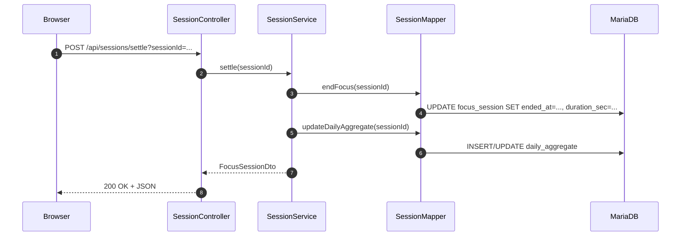

# 아키텍처 & 코드 구조

## 레이어
```
Controller  →  Service  →  DAO(MyBatis)  →  DB
```

- **Controller**: 요청/응답, 검증, 에러 핸들링
- **Service**: 트랜잭션, 비즈니스 로직
- **DAO(MyBatis)**: SQL 매핑, 성능 고려 쿼리
- **DB**: 정규 테이블 + 집계 테이블(`daily_aggregate`)

## 요청 흐름 (예: 세션 정산)


## 예외 처리
- 무결성 위반: 409(CONFLICT) `ProblemDetail` 응답
- 기타 예외: 500(INTERNAL_SERVER_ERROR) JSON 메시지

## 설정
- `application.yml`: profile, Jackson timezone/format, Actuator 일부 노출
- `application-dev.yml`: 데이터소스(HikariCP), MyBatis 설정

## 빌드/배포 팁
- `./gradlew bootJar` → 단일 JAR
- 환경별 `application-*.yml` 분리 + Secret 관리
- Nginx(SSL) 리버스 프록시 / CORS 설정(필요 시)
